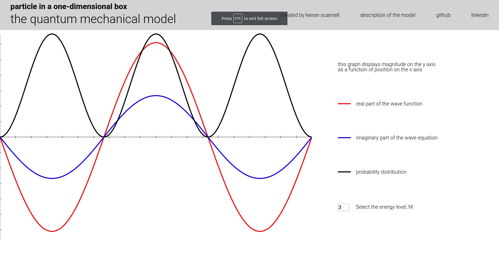

# Quantum Mechanical Particle-in-a-box Simulator



# Instructions

Select a value for `N` on the right hand side to change the energy level of the system.

# Short Background

This simulation represents the quantum mechanical model for a particle in a one-dimensional box.

The equations are solutions for the time dependent schrodinger equation in one dimension. The real part and imaginary part of the solution are plotted separately.

The behavior of this system is governed by the schrodinger equation. It has several interesting characteristics:

* Energy is quantized, which means the energy of the particle can only have certain discrete values, and the energy can never be zero.

* We cannot predict exactly where the particle will be at any time, or what its momentum will be. Instead, the particle is represent by a wave function.

* The wave function, when squared, gives us a probability distribution for the location of the particle. This represents the likelihood that the particle will be found at a given location.

# Architecture and Technologies

* Vanilla javascript for the core logic

* HTML5 Canvas to draw and animate the graph and wave functions

* NPM and webpack to bundle js files

# Potential Future features

* Display the equation that is being rendered, with variables that update as sliders are adjusted.
* Make gradients rather than just line graphs
* Allow for superposition of one or more energy levels.
* Add another graph for momentum
* Add more complex systems beyond particle in a box

# Technical Implementation Details

* The coordinate system used by html5 canvas is mapped to a mathematical coordinate system using the following code:

```javascript
// Returns the canvas x-coordinate of a math x-coordinate:
mapX(x) {
  return ((x - this.minimumX()) /
    (this.maximumX() - this.minimumX())) * this.WIDTH;
},

// Returns the canvas y-coordinate of a math y-coordinate:
mapY(y) {
  return this.HEIGHT - ((y - this.minimumY()) /
    (this.maximumY() - this.minimumY())) * (this.HEIGHT - 5);
}
```

* Mathematical functions are plotted point by point using the following code:

```javascript
renderMathFunction(f, color) {
  // const t = time/1000;
  let first = true;

  this.ctx.beginPath();
  for (let x = util.minimumX(); x <= util.maximumX(); x += util.xStep()) {
    const y = f(x);

    if (first) {
      this.ctx.moveTo(util.mapX(x), util.mapY(y));
      first = false;
    } else {
      this.ctx.lineTo(util.mapX(x), util.mapY(y));
    }
  }
  this.ctx.lineWidth = 4;
  this.ctx.strokeStyle = color;
  this.ctx.stroke();
}
```